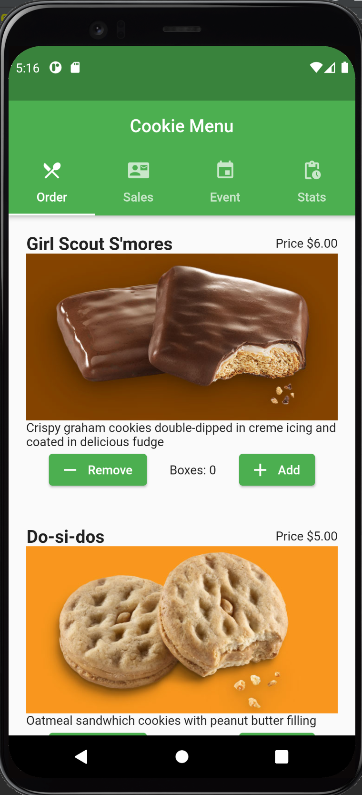
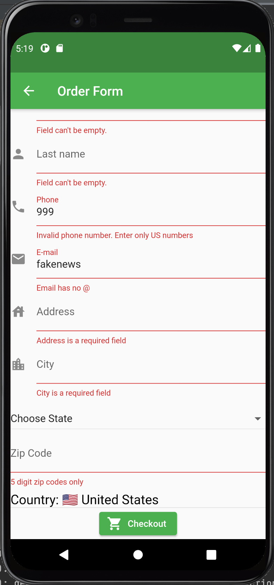
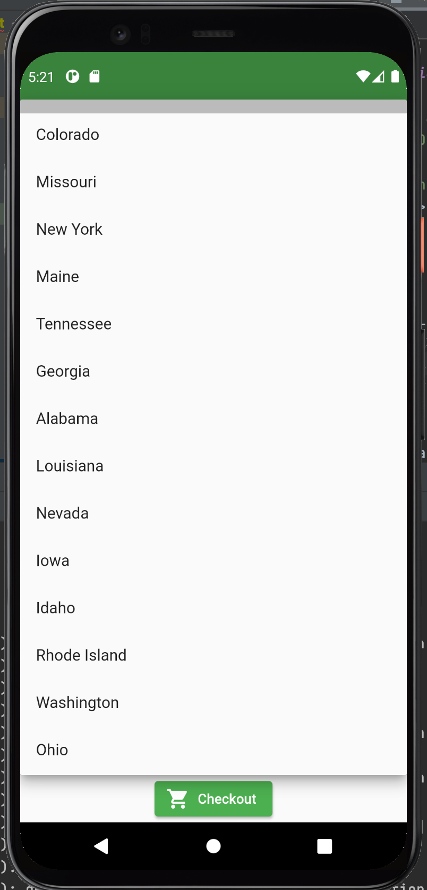
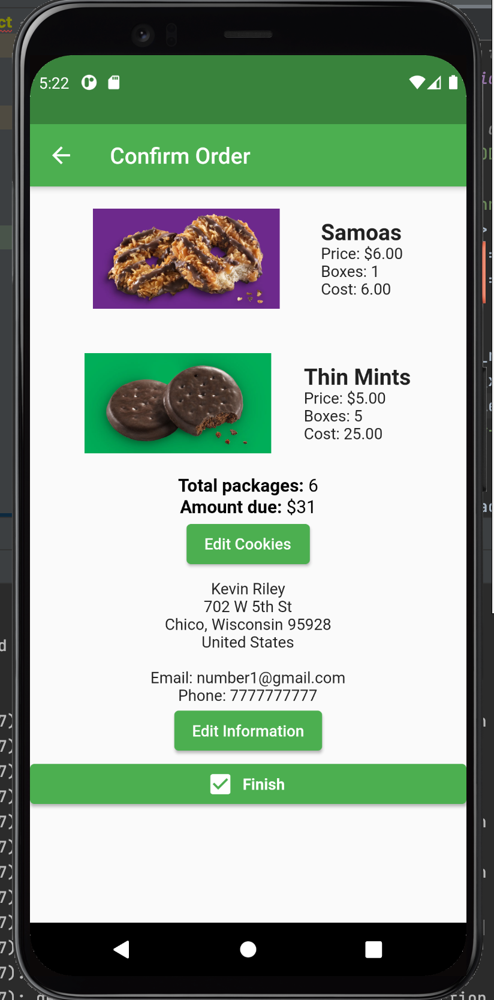
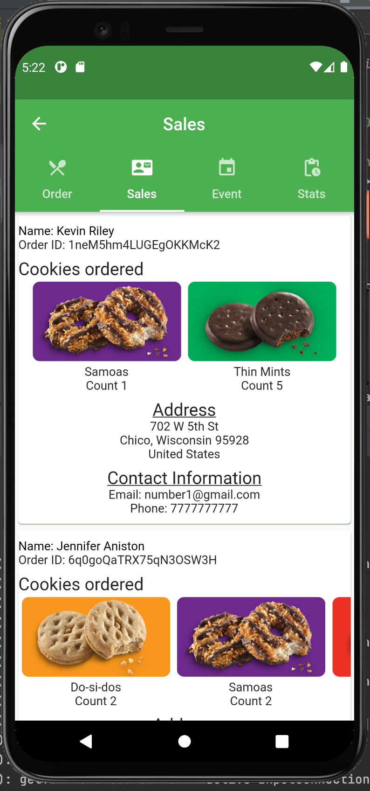
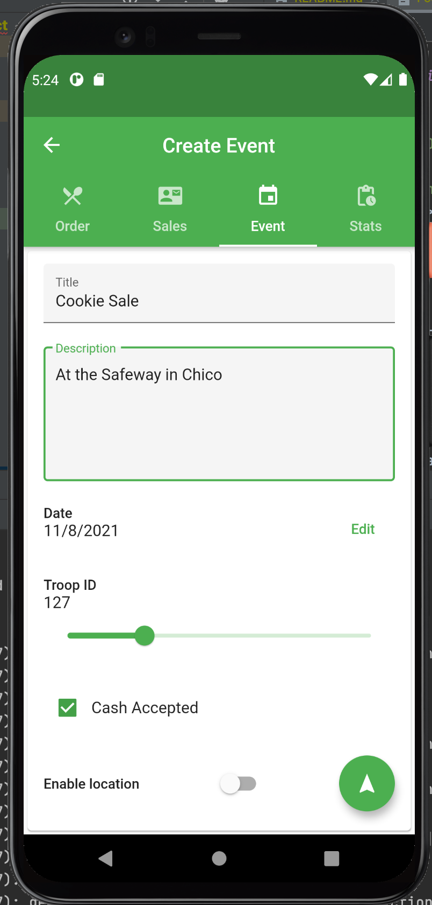
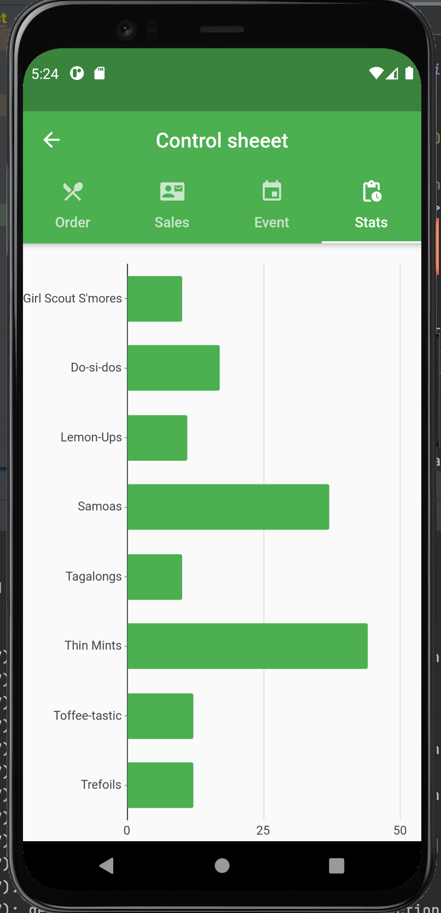

# scout
Cross platform application for iOS and Android using Google's SDK Flutter. 

Launch screen for the application. 

The menu for selecting cookies. Customers can see basic information about the cookie then select how many cookies they would like. 

Once the customer has selected their desired cookies, they fill out a form with order information for shipping and receipt. The form validates all input except for checking if the phone number or email is active, and does not check if the address is legitmate.

A pop up menu that the user can scroll to select their state. 

 

A final view for users to make sure everything in their order is correct. The buttons will reroute the user back to those respective views. When they return, only modification will be applied and everything else will be as it was originally. 

Girl scouts can view all the orders that are stored in the firebase database in a more user friendly manner. Here you can see the Kevin Rileys order from the above pictures has been successfully uploaded to the database.

Scouts can create an event to alert followers where and when they will be selling cookies. 

Scouts can keep track of their orders so they know how many cookies to process. This will make keeping track of inventory easier.  
